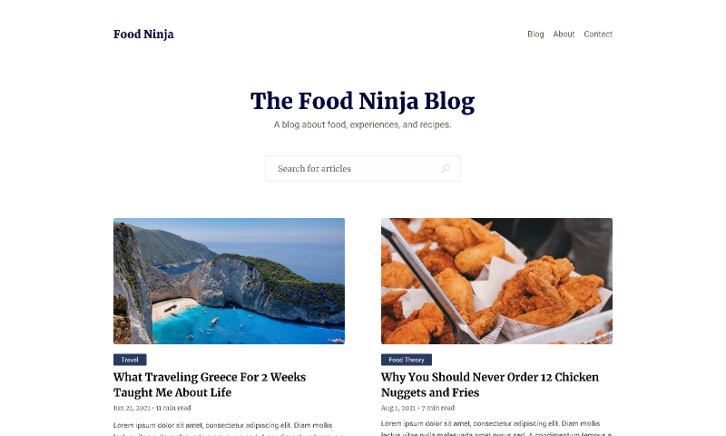

<div align="center">
    
</div>


Food Ninja Blog, is a modern blog built in with Hygraph CMS for posts and all content of foods and lifestyle healthy. It also has Next.js and Tailwind for management your UI and funcionalities, and have all components covered with TDD, using Testing Library and Vitest.


---
## :art: Layout
[Figma](https://www.figma.com/community/file/1025717035770439865/free-clean-minimal-blog-theme)


---
## :file_folder: Techs
- [Next.js](https://nextjs.org/)
- [Tailwind](https://tailwindcss.com/)
- [Vitest](https://vitest.dev/)
- [MSW](https://mswjs.io/)
- [Hygraph CMS](https://hygraph.com/)
- [React Query](https://tanstack.com/query/latest/docs/framework/react/overview)
- [Zod](https://zod.dev/)
- [Biome.js](https://biomejs.dev/pt-br/)

---
## :book: Features

- Application developed following TDD principles, testing first, developing and refactoring what is necessary 
- Test coverage of the main components of the application 
- Use of MSW to simulate calls to the API in the test environment 
- Use of Rich Texts, to bring all posts already styled directly from the CMS 
- Fetch of data passing both on the server side, as is done on the selected post page, and also in client side, on the first page where the posts are rendered, with React Query 
- Pagination on the Frontend 
- Queries in GraphQL
---


## :receipt: Environment variables

```
API_URL=
NEXT_PUBLIC_API_URL
```

---

## :desktop_computer: How to run

```
npm run dev
```

---
<h2 id="colab">🤝 Collaborators</h2>
 <tr>
    <td align="center">
      <a href="https://github.com/lucasgomesgp">
        <br>
        <sub>
          <b>Lucas Gomes</b>
        </sub>
      </a>
    </td>
  </tr>
</table>


